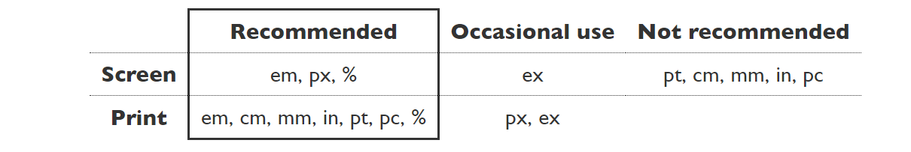

# What I learned

## HTML

Markdown preview = Ctrl+Shift+V

- label, element represent a caption for an item in a interface
[Learn More](https://developer.mozilla.org/en-US/docs/Web/HTML/Element/label)

- Class vs Id

A Class name can be used by multiple HTML elements, while an ID name must only be used by one HTML element within the page.

- position: relative vs absolute

relative: move from their relative position

absolute: move from top left (absoute position)


- Em  (unit in Css)

em is a units in css that are relative


[Source](https://www.w3.org/Style/Examples/007/units.en.html#:~:text=The%20em%20is%20simply%20the,sizes%20will%20be%20in%20proportion.)


- document.getElementsByClassName returns an array of elements, 
you use indexing according to the element you want

- Some time you want to wait until the DOM (document object model) fully load

by using this code

```js
    window.addEventListener("DOMContentLoaded", (event) =>
    {

    })
```

- CSS selector

```css
.className {
  /* CSS rules for the class */
}

#idName {
  /* CSS rules for the ID */
}

.parentClass .childClass {
  /* CSS rules for the child class */
}

.parentClass > .childClass {
 /* CSS rules for the direct child class */
}

and many other CSS selector

